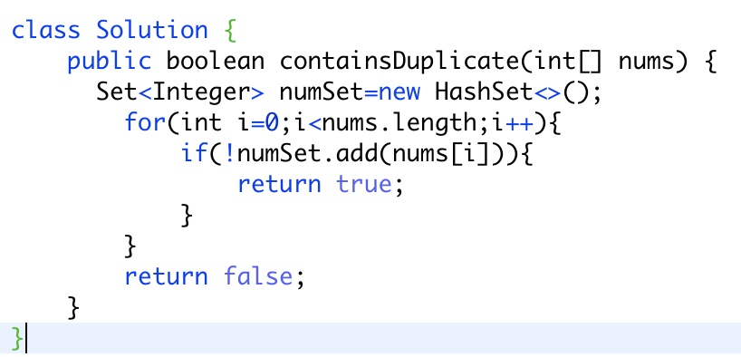
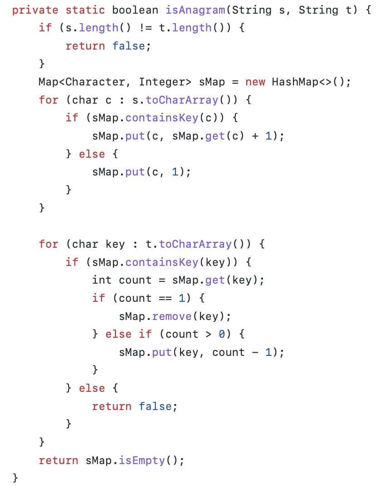
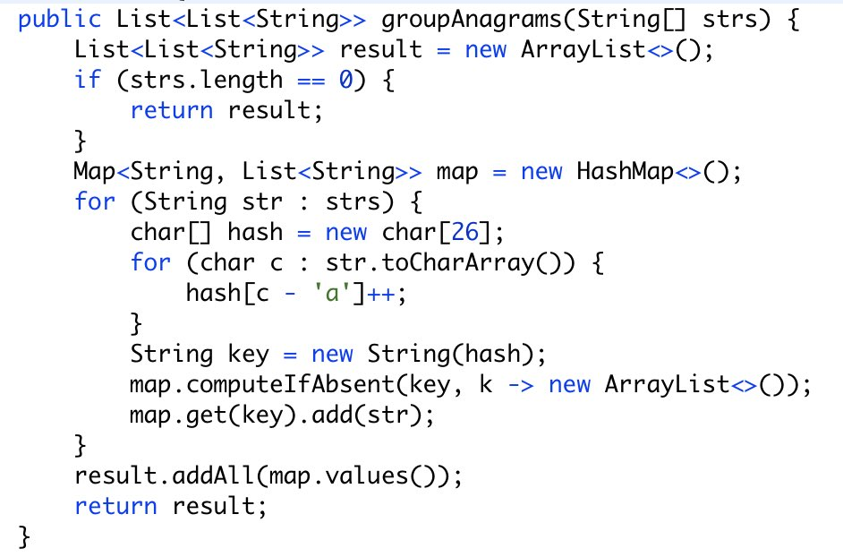

# LeetCode

## Array
**1. Two Sum** 

Given an array of integers nums and an integer target, return indices of the two numbers such that they add up to target.
You may assume that each input would have exactly one solution, and you may not use the same element twice.
You can return the answer in any order.

Example 1:
Input: nums = [2,7,11,15], target = 9
Output: [0,1]
Explanation: Because nums[0] + nums[1] == 9, we return [0, 1].

Example 2:
Input: nums = [3,2,4], target = 6
Output: [1,2]

 

**2. Contains Duplicate**

Given an integer array nums, return true if any value appears at least twice in the array, and return false if every 
element is distinct.

Example 1:
Input: nums = [1,2,3,1]
Output: true

**3. Valid Anagram**

Given two strings s and t, return true if t is an anagram of s, and false otherwise.
An Anagram is a word or phrase formed by rearranging the letters of a different word or phrase, typically using all the original letters exactly once.

Example 1:
Input: s = "anagram", t = "nagaram"
Output: true

**4. Group Anagrams**

Given an array of strings strs, group the anagrams together. You can return the answer in any order.

Example 1:
Input: strs = ["eat","tea","tan","ate","nat","bat"]
Output: [["bat"],["nat","tan"],["ate","eat","tea"]]

